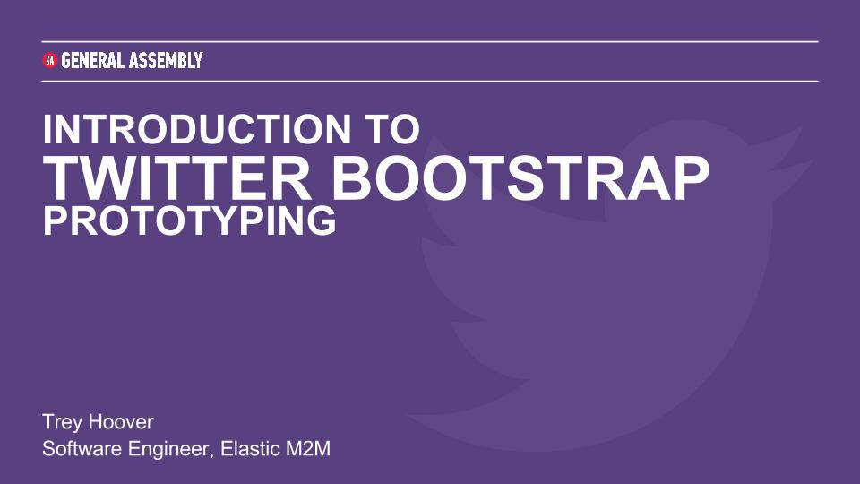

What We're Building
-------------------
Inspired by [Rainy Mood](http://rainymood.com), I felt the world needed [Strainy Mood](http://treyhoover.github.io/bootstrap_workshop). 

I'll be demonstrating how we can build this page with bootstrap, so feel free to follow along with the provided code or apply these techniques to your own project.

About This Workshop
-------------------
With its streamlined features, customizability, and compliant code, Twitter Bootstrap has quickly become the most trusted framework on the web. This workshop will show designers and product managers how to use Bootstrap to create digital wireframes and production-ready mockups for project stakeholders and team members. Attendees will learn how to customize the CSS, build a responsive page/site, and address problems they’ve been trying to solve. At the end of the workshop, students will present their results and we’ll preview them on iPads and mobile phones.

Takeaways
---------
* Learn how to prototype your ideas for presentation to stakeholders and developers
* Reduce development time
* Create digital mockups and style guides for your team to follow

Prereqs & Preparation
---------------------
Students should have HTML & CSS knowledge, you must also bring a laptop with a text HTML/CSS editor such as [Sublime](http://sublimetext.com/), [Coda](http://panic.com/coda/), [BBEdit](http://barebones.com/), or [Dreamweaver](http://www.adobe.com/products/dreamweaver.html), as well as paper to sketch out your ideas quickly. Also, please bring a project you’re working on or would like to create. You should have a Dropbox or an FTP account where you can upload your work to review at the end of the workshop.

Additional Resources
--------------------
* **[Slides](https://docs.google.com/presentation/d/1vOzRSgYBeWH4U8UYhbw-qyq1pCp-nt7vMK85bsMXvLQ)**
* **Review, examples, and reference**
  * getbootstrap.com/getting-started
  * codeschool.com/courses/blasting-off-with-bootstrap (review)
* **SASS**
  * sass-lang.com
  * github.com/twbs/bootstrap-sass
* **Help**
  * @techytrey, @getbootstrap
  * treyhoover@gmail.com
  * [StackOverflow](http://stackoverflow.com/), [codementor](https://www.codementor.io/)